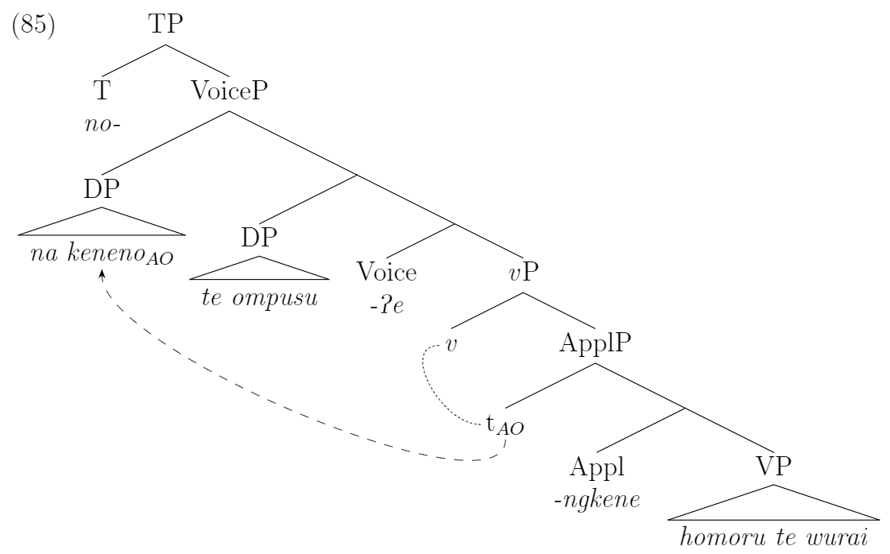
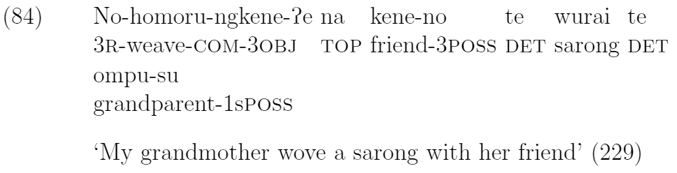

# About Kendra Chalkley

Hello! I am Kendra Chalkley. I use kchalk on as my web handle where I can, and kd.chalkley in the few places where I can't. 

I am a linguist, a computer scientist, an academic, and a nerd. I prefer syntax and morphology over phonetics, machine learning over software development, data over guesswork, and boardgames over hikes. Historically I am also the kind of person whom my classmates have mistakenly assumed is a TA and who considers getting a PHD to be a strong backup plan. I am currently looking for my first technical professional position, and I would really love the chance to fill a few gaps in the basics that I missed by jumping straight into an MS CS without any undergraduate coding experience.

I have a few projects to show off, all of which are available on [my github](github.com/kchalk). As I write more intereting introductions to each of them, I'll post them here. Meanwhile here are some links to:

- My masters' research project
  - [A notebook](./Data/t-SNE_Examples.html) showing t-SNE clusters of subreddits based on word use
  - [Git repo]( https://www.github.com/kchalk/RedditProject)
  - A downloadable [PowerPoint](./Data/FinalTsnePres.pptx) explaining t-SNE (presentation notes to come)

- Profile information
  - My [resume](./Data/Chalkley_Resume.pdf) (including contact info)
  - [My LinkedIn profile]( http://www.linkedin.com/in/kchalk)

- My undergraduate thesis
  - In [pdf](./Data/AppliedAsymmetries.pdf)
  - Some snippets to spark your curiousity:

  
  
  
