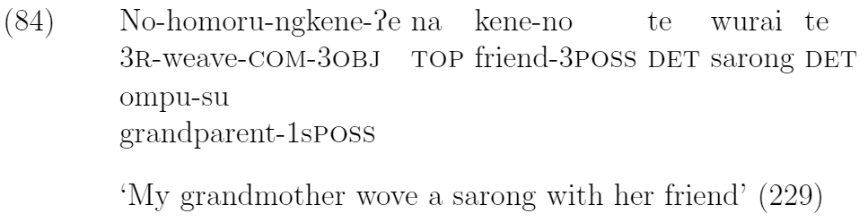

# Welcome

I'm a computational linguist looking for language-oriented data science or machine learning work in Portland, SF Bay, or wherever else I might have to move to start my career. I have a few projects to show off, all of which are available on [my github](github.com/kchalk). I'll link to public facing explanations of these projects as I finish writing commentary. Meanwhile here are some links to: 

- My masters' research project
  - [A notebook](./Data/t-SNE_Examples.html) showing t-SNE clusters of subreddits based on word use
  - [Git repo]( https://www.github.com/kchalk/RedditProject)
  - A downloadable [PowerPoint](./Data/FinalTsnePres.pptx) explaining t-SNE (presentation notes to come)

- Profile information
  - My [resume](./Data/Chalkley_Resume.pdf) (including contact info)
  - [My LinkedIn profile]( http://www.linkedin.com/in/kchalk)

- My undergraduate thesis
  - In [pdf](./Data/AppliedAsymmetries.pdf)
  - Some snippets to spark your curiousity:

  
  
  
